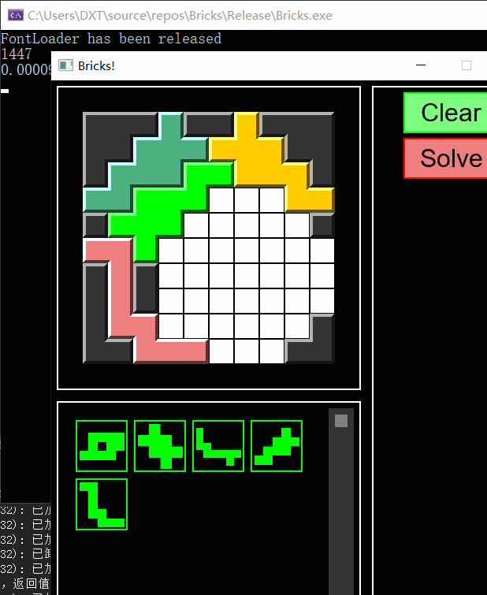

# 拼图
一个基于GLFW3和freetype字体库的拼图游戏框架
夹带私货，一个Voronoi图的实现和最小圆覆盖算法

## 计划
- [x] 添加一个完善的立即UI（IMGUI）系统
- [x] 添加对字体的支持
- [ ] 添加对非直角旋转的支持
- [ ] 把基础局面的无解求解优化到1s以内
- [ ] 添加物块的剩余可使用次数文本
- [ ] 物块编辑器
- [ ] 保存当前编辑物块的功能
- [ ] UI系统：添加动画速率
- [ ] 实现Solve按钮的功能